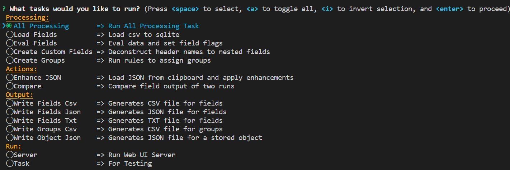
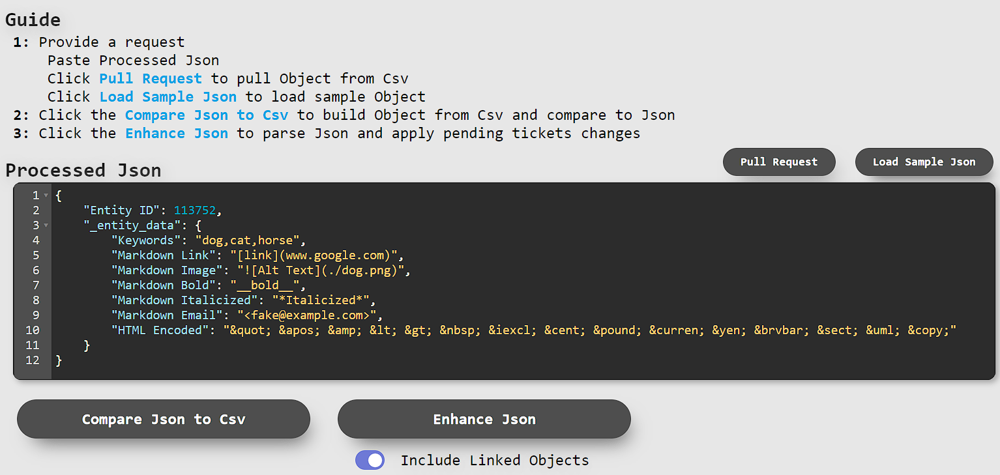
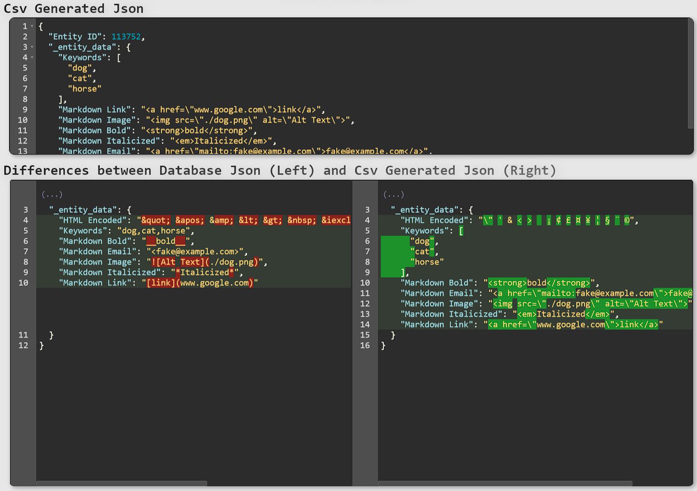

# CSV Preprocessor
Imports and processes CSV files to generate flags and groups for use when loading data.

## Prerequisite
- Download CSV files to `./data/` or use provided `./data/sample.csv`
- Run `npm i`.

## Run
- `npm start` => Runs task selector.
    - Start by selecting __All Processing__ and select all CSV files to load
        
    - Loading 6 CSV files totaling 900+MB takes < 20 min, depending on hardware, resulting in a 11+GB SQLite DB
        
    - Once data is loaded, Select __Server__ to compare and enhance Json
        - Click __Load Sample Data__ to load sample Object
        
        - Click __Enhance Json__ to see output Json
        